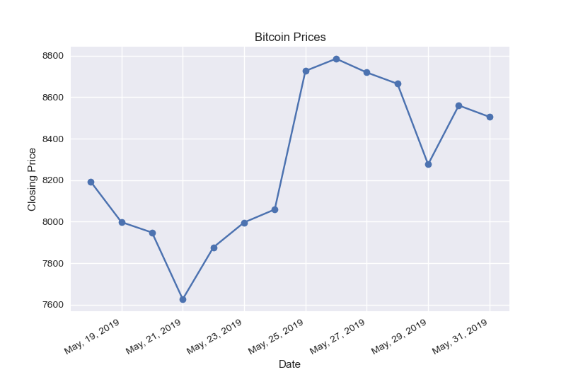

# Workflow of the Code:
1. Importing the libraries and data
2. Simple Date Plot
3. Converting Into lines
4. Formatting the X-Axis
5. Formatting the dates
6. Importing Data through CSV
7. Plotting the CSV Data
8. Fixing the string issue

# Picture of the Final Graph:

